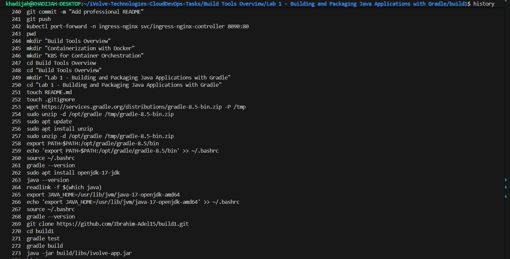
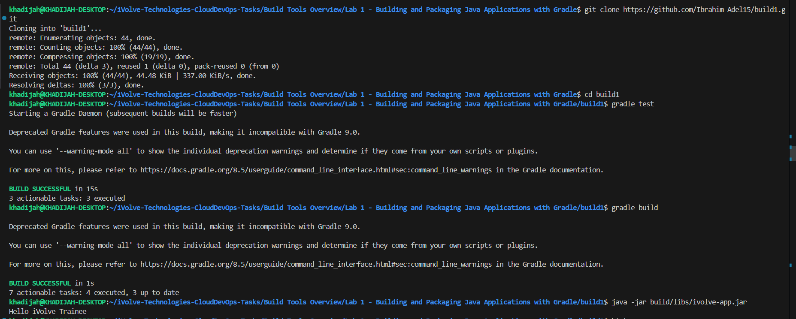

# Lab 1: Building and Packaging Java Applications with Gradle

## Objective

Install Gradle, clone a Java application from GitHub, run unit tests, build the application into a JAR artifact, and verify it runs correctly.

---

## Prerequisites

- Ubuntu / Debian-based Linux system
- Java JDK installed
- Internet connection

---

## Steps

### 1. Install Gradle

Download and install Gradle 8.5 manually:

```bash
wget https://services.gradle.org/distributions/gradle-8.5-bin.zip -P /tmp

sudo unzip -d /opt/gradle /tmp/gradle-8.5-bin.zip

export PATH=/opt/gradle/gradle-8.5/bin:$PATH

echo 'export PATH=/opt/gradle/gradle-8.5/bin:$PATH' >> ~/.bashrc
```

Verify the installation:

```bash
gradle --version
```

---

### 2. Clone the Source Code

```bash
git clone https://github.com/Ibrahim-Adel15/build1.git

cd build1
```

---

### 3. Run Unit Tests

```bash
gradle test
```

Expected output:

```text
BUILD SUCCESSFUL in 15s
3 actionable tasks: 3 executed
```

---

### 4. Build the Application

```bash
gradle build
```

Expected output:

```text
BUILD SUCCESSFUL in 1s
7 actionable tasks: 4 executed, 3 up-to-date
```

This generates the artifact at:

```text
build/libs/ivolve-app.jar
```

---

### 5. Run the Application

```bash
java -jar build/libs/ivolve-app.jar
```

Expected output:

```text
Hello iVolve Trainee
```

---

## Screenshots

### Commands Used



---

### Results



---

## Summary

| Step | Command | Result |
|------|------|------|
| Install Gradle | wget + unzip + export PATH | Gradle 8.5 installed |
| Clone repo | git clone | Source code downloaded |
| Run tests | gradle test | BUILD SUCCESSFUL |
| Build app | gradle build | JAR generated in build/libs/ |
| Run app | java -jar build/libs/ivolve-app.jar | Hello iVolve Trainee |

---

## Notes

- Gradle 8.5 shows deprecation warnings about features incompatible with Gradle 9.0.
- These warnings do not affect the build and can be ignored for this lab.
- To make the PATH change permanent across sessions, the export line is appended to `~/.bashrc`.