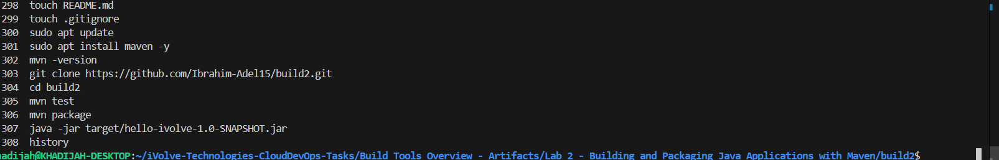
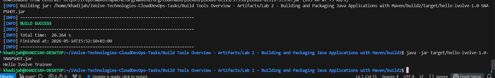

# Lab 2: Building and Packaging Java Applications with Maven

## Objective

Install Maven, clone a Java application from GitHub, run unit tests, build the application into a JAR artifact, and verify it runs correctly.

---

## Prerequisites

- Ubuntu / Debian-based Linux system
- Java JDK installed
- Internet connection

---

## Steps

### 1. Install Maven

```bash
sudo apt update

sudo apt install maven -y
```

Verify the installation:

```bash
mvn -version
```

---

### 2. Clone the Source Code

```bash
git clone https://github.com/Ibrahim-Adel15/build2.git

cd build2
```

---

### 3. Run Unit Tests

```bash
mvn test
```

Expected output:

```text
[INFO] BUILD SUCCESS
```

---

### 4. Build the Application

```bash
mvn package
```

Expected output:

```text
[INFO] BUILD SUCCESS
```

This generates the artifact at:

```text
target/hello-ivolve-1.0-SNAPSHOT.jar
```

---

### 5. Run the Application

```bash
java -jar target/hello-ivolve-1.0-SNAPSHOT.jar
```

Expected output:

```text
Hello iVolve Trainee
```

---

## Screenshots

### Commands Used



---

### Results



---

## Summary

| Step | Command | Result |
|------|------|------|
| Install Maven | apt install maven | Maven installed successfully |
| Clone repo | git clone | Source code downloaded |
| Run tests | mvn test | BUILD SUCCESS |
| Build app | mvn package | JAR generated in target/ |
| Run app | java -jar target/hello-ivolve-1.0-SNAPSHOT.jar | Hello iVolve Trainee |

---

## Notes

- Maven follows a lifecycle-based build system (`clean`, `compile`, `test`, `package`).
- The generated JAR file is located inside the `target/` directory.
- Ensure Java is properly installed and configured before running Maven commands.