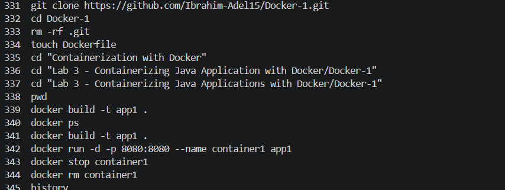
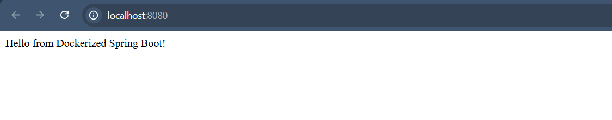

# Lab 3: Run Java Spring Boot App in a Container

## Objective

Clone a Spring Boot application, containerize it using Docker, build the image, run the container, and verify the application is working.

---

## Prerequisites

- Ubuntu / Debian-based Linux system
- Java JDK installed
- Maven installed
- Docker installed
- Internet connection

---

## Steps

### 1. Clone the Source Code

```bash
git clone https://github.com/Ibrahim-Adel15/Docker-1.git

cd Docker-1
```

---

### 2. Write Dockerfile

Create a Dockerfile in the project root:

```dockerfile
FROM maven:3.9.6-eclipse-temurin-17

WORKDIR /app

COPY . .

RUN mvn package

EXPOSE 8080

CMD ["java", "-jar", "target/demo-0.0.1-SNAPSHOT.jar"]
```

---

### 3. Build Docker Image

```bash
docker build -t app1 .
```

Expected output:

```text
Successfully built <image_id>
Successfully tagged app1:latest
```

---

### 4. Run the Container

```bash
docker run -d -p 8080:8080 --name container1 app1
```

---

### 5. Test the Application

Open your browser and navigate to:

```text
http://localhost:8080
```

Expected result:

```text
Hello from Dockerized Spring Boot!
```

---

### 6. Stop and Remove the Container

```bash
docker stop container1

docker rm container1
```

---

## Screenshots

### Commands Used



---

### Results



---

## Summary

| Step | Command | Result |
|------|----------|---------|
| Clone repo | git clone | Source code downloaded |
| Create Dockerfile | Dockerfile | Container instructions defined |
| Build image | docker build -t app1 . | Image created successfully |
| Run container | docker run -d -p 8080:8080 | App running in container |
| Test app | Browser request | Application accessible |
| Stop container | docker stop && docker rm | Container removed |

---

## Notes

- The application runs on port 8080, which is mapped to the host machine.
- Ensure Docker service is running before building the image.
- The JAR file is generated during the Docker build process using Maven.
- You can check running containers using `docker ps`.