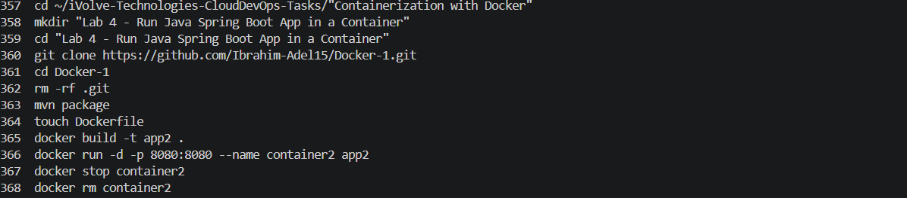
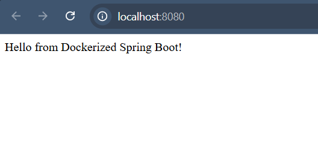

# Lab 4: Run Java Spring Boot App in a Container

## Objective

Clone a Spring Boot application, build the application using Maven, create a Docker image using the generated JAR file, run the container, and verify the application is working.

---

## Prerequisites

- Ubuntu / Debian-based Linux system
- Java JDK installed
- Maven installed
- Docker installed
- Internet connection

---

## Steps

### 1. Clone the Source Code

```bash
git clone https://github.com/Ibrahim-Adel15/Docker-1.git

cd Docker-1
```

---

### 2. Build the Application

```bash
mvn package
```

Expected output:

```text
BUILD SUCCESS
```

This generates the JAR file at:

```text
target/demo-0.0.1-SNAPSHOT.jar
```

---

### 3. Write Dockerfile

Create a Dockerfile in the project root:

```dockerfile
FROM eclipse-temurin:17

WORKDIR /app

COPY target/demo-0.0.1-SNAPSHOT.jar app.jar

EXPOSE 8080

CMD ["java", "-jar", "app.jar"]
```

---

### 4. Build Docker Image

```bash
docker build -t app2 .
```

Expected output:

```text
Successfully built <image_id>
Successfully tagged app2:latest
```

---

### 5. Check Image Size

```bash
docker images
```

Expected result:

```text
app2 image size is smaller than app1
```

---

### 6. Run the Container

```bash
docker run -d -p 8080:8080 --name container2 app2
```

---

### 7. Test the Application

Open your browser and navigate to:

```text
http://localhost:8080
```

Expected result:

```text
Hello from Dockerized Spring Boot!
```

---

### 8. Stop and Remove the Container

```bash
docker stop container2

docker rm container2
```

---

## Screenshots

### Commands Used



---

### Results



---

## Summary

| Step | Command | Result |
|------|----------|---------|
| Clone repo | git clone | Source code downloaded |
| Build application | mvn package | JAR file generated successfully |
| Create Dockerfile | Dockerfile | Container instructions defined |
| Build image | docker build -t app2 . | Docker image created successfully |
| Check image size | docker images | app2 image size verified |
| Run container | docker run -d -p 8080:8080 | App running in container |
| Test app | Browser request | Application accessible |
| Stop container | docker stop && docker rm | Container removed |

---

## Notes

- In this lab, the application is built outside Docker using Maven.
- Only the generated JAR file is copied into the Docker image.
- This approach creates a smaller Docker image compared to building the application inside Docker.
- Port `8080` is exposed for accessing the Spring Boot application.