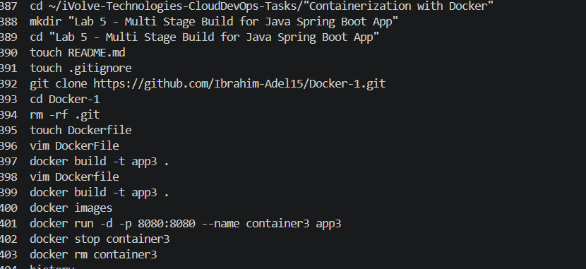
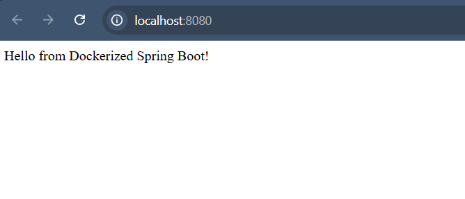

# Lab 5: Multi Stage Build for Java Spring Boot App

## Objective

Clone a Spring Boot application, build it using a multi-stage Docker build, create a smaller optimized Docker image, run the container, and verify the application is working.

---

## Prerequisites

- Ubuntu / Debian-based Linux system
- Docker installed
- Internet connection

---

## Steps

### 1. Clone the Source Code

```bash
git clone https://github.com/Ibrahim-Adel15/Docker-1.git

cd Docker-1
```

---

### 2. Write Dockerfile

Create a Dockerfile in the project root:

```dockerfile
FROM maven:3.9.6-eclipse-temurin-17 AS build

WORKDIR /app

COPY . .

RUN mvn package

FROM eclipse-temurin:17

WORKDIR /app

COPY --from=build /app/target/demo-0.0.1-SNAPSHOT.jar app.jar

EXPOSE 8080

CMD ["java", "-jar", "app.jar"]
```

---

### 3. Build Docker Image

```bash
docker build -t app3 .
```

Expected output:

```text
Successfully built <image_id>
Successfully tagged app3:latest
```

---

### 4. Check Image Size

```bash
docker images
```

Expected result:

```text
app3 image size is smaller than app1
```

---

### 5. Run the Container

```bash
docker run -d -p 8080:8080 --name container3 app3
```

---

### 6. Test the Application

Open your browser and navigate to:

```text
http://localhost:8080
```

Expected result:

```text
Hello from Dockerized Spring Boot!
```

---

### 7. Stop and Remove the Container

```bash
docker stop container3

docker rm container3
```

---

## Screenshots

### Commands Used



---

### Results



---

## Summary

| Step | Command | Result |
|------|----------|---------|
| Clone repo | git clone | Source code downloaded |
| Create Dockerfile | Dockerfile | Multi-stage Docker build configured |
| Build image | docker build -t app3 . | Optimized Docker image created |
| Check image size | docker images | Reduced image size verified |
| Run container | docker run -d -p 8080:8080 | App running in container |
| Test app | Browser request | Application accessible |
| Stop container | docker stop && docker rm | Container removed |

---

## Notes

- Multi-stage builds help reduce Docker image size by separating build and runtime environments.
- Maven is only used during the build stage.
- The final image contains only Java runtime and the packaged JAR file.
- Port `8080` is exposed for accessing the Spring Boot application.