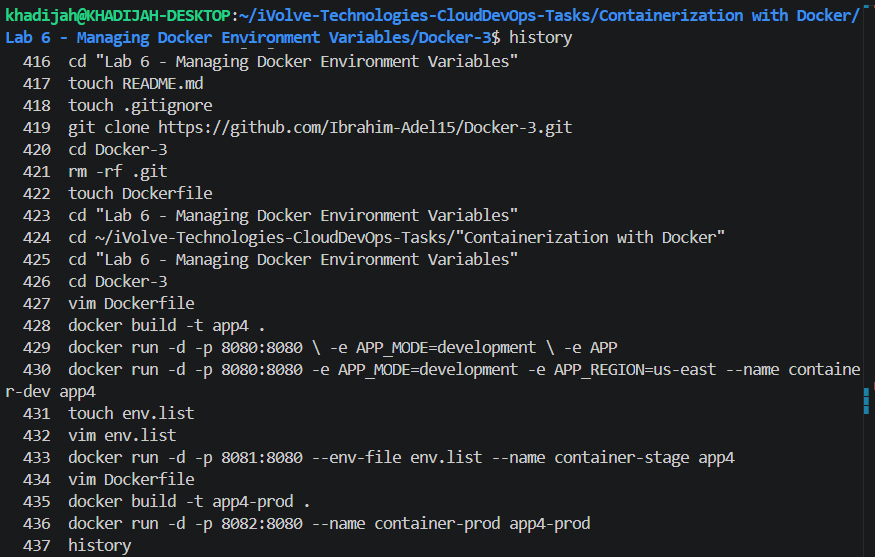
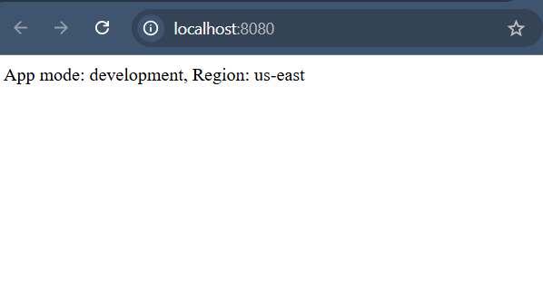
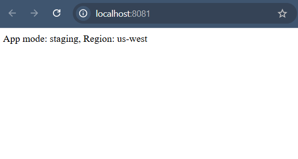
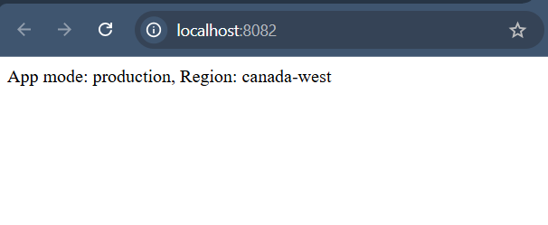

# Lab 6: Managing Docker Environment Variables Across Build and Runtime

## Objective

This lab demonstrates three different ways to pass environment variables to Docker containers. The same image was used to run three containers, each with different configurations for APP_MODE and APP_REGION, showcasing how Docker handles environment variables at both build time and runtime.


---

## Prerequisites

- Ubuntu / Debian-based Linux system
- Docker installed
- Internet connection

---

## Steps

### 1. Clone the Source Code

```bash
git clone https://github.com/Ibrahim-Adel15/Docker-3.git

cd Docker-3
```

---

### 2. Write Dockerfile

Create a Dockerfile in the project root:

```dockerfile
FROM python:3.11

WORKDIR /app

COPY . .

RUN pip install flask

EXPOSE 8080

CMD ["python", "app.py"]
```

---

### 3. Build Docker Image

```bash
docker build -t app4 .
```

---

## Part 1: Environment Variables Using Command Line

### Run Development Container

```bash
docker run -d -p 8080:8080 \
-e APP_MODE=development \
-e APP_REGION=us-east \
--name container-dev app4
```

---

### Verify Variables

```bash
docker exec -it container-dev env
```

---

## Part 2: Environment Variables Using External File

### Create Environment File

```bash
touch staging.env
```

Add the following content:

```env
APP_MODE=staging
APP_REGION=us-west
```

---

### Run Staging Container

```bash
docker run -d -p 8081:8080 \
--env-file staging.env \
--name container-stage app4
```

---

### Verify Variables

```bash
docker exec -it container-stage env
```

---

## Part 3: Environment Variables Inside Dockerfile

Update Dockerfile:

```dockerfile
FROM python:3.11

WORKDIR /app

COPY . .

RUN pip install flask

ENV APP_MODE=production
ENV APP_REGION=canada-west

EXPOSE 8080

CMD ["python", "app.py"]
```

---

### Build Production Image

```bash
docker build -t app4-prod .
```

---

### Run Production Container

```bash
docker run -d -p 8082:8080 \
--name container-prod app4-prod
```

---

### Verify Variables

```bash
docker exec -it container-prod env
```

---

## Testing the Application

Open the browser and navigate to:

```text
http://localhost:8080
http://localhost:8081
http://localhost:8082
```

---

## Screenshots

### Commands Used



---

### Results



---

### Results



---

### Results



---

## Summary

| Step | Command | Result |
|------|----------|---------|
| Clone repo | git clone | Source code downloaded |
| Create Dockerfile | Dockerfile | Flask container configured |
| Build image | docker build -t app4 . | Docker image created successfully |
| Run dev container | docker run with -e | Runtime variables passed successfully |
| Run staging container | docker run with --env-file | Variables loaded from file |
| Run production container | ENV in Dockerfile | Variables embedded during build |
| Verify variables | docker exec env | Environment variables displayed |
| Test application | Browser / curl | Application accessible |

---

## Notes

- Environment variables can be passed during runtime using `-e`.
- Multiple variables can be stored inside external `.env` files using `--env-file`.
- Variables defined using `ENV` inside Dockerfile become part of the image.
- Different host ports were used to run multiple containers simultaneously.