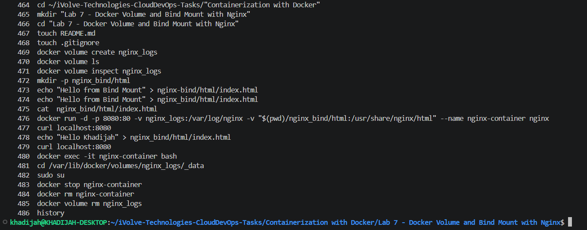
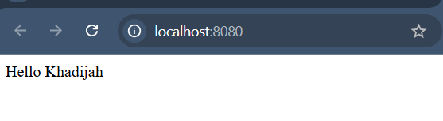

# Lab 7: Docker Volume and Bind Mount with Nginx

## Overview

This lab demonstrates two Docker storage mechanisms — volumes and bind mounts — using an Nginx container. A named volume is used to persist Nginx logs, while a bind mount links a local directory to the container’s web root, allowing real-time content updates without rebuilding the image.

---

## Key Concepts

### Named Volume (`nginx_logs`)

A Docker named volume was created to persist Nginx access and error logs at:

```text
/var/log/nginx
```

inside the container.

The volume is managed by Docker and stored in Docker’s default volumes path:

```text
/var/lib/docker/volumes/nginx_logs/_data
```

This ensures logs remain available even after removing the container.

---

### Bind Mount (`nginx_bind/html`)

A local directory on the host machine was mounted to:

```text
/usr/share/nginx/html
```

inside the container.

This allowed the container to serve HTML content directly from the host machine. Any modification made to the local `index.html` file was reflected immediately in the running container without rebuilding or restarting it.

---

## Tools Used

- Docker — Used for containerization, storage management, and volume handling.
- Nginx — Used as the web server to serve the custom HTML page.

---

## Steps

### 1. Create Docker Volume

```bash
docker volume create nginx_logs
```

---

### 2. Verify Docker Volume

```bash
docker volume ls
```

Inspect the volume:

```bash
docker volume inspect nginx_logs
```

Expected output includes a mount point similar to:

```text
/var/lib/docker/volumes/nginx_logs/_data
```

---

### 3. Create Bind Mount Directory

```bash
mkdir -p nginx_bind/html
```

---

### 4. Create Custom HTML File

```bash
echo "Hello from Bind Mount" > nginx_bind/html/index.html

```

---

### 5. Run Nginx Container

```bash
docker run -d \
-p 8080:80 \
-v nginx_logs:/var/log/nginx \
-v "$(pwd)/nginx_bind/html:/usr/share/nginx/html" \
--name nginx-container \
nginx
```

---

## Explanation

### Docker Volume

```text
nginx_logs:/var/log/nginx
```

Used to persist Nginx logs outside the container.

---

### Bind Mount

```text
$(pwd)/nginx_bind/html:/usr/share/nginx/html
```

Maps the local HTML directory from the host machine into the container.

---

## 6. Verify Nginx Page

Run:

```bash
curl localhost:8080
```

Expected output:

```html
<h1>Hello from Bind Mount</h1>
```

---

## 7. Modify HTML File

Edit `index.html` and change the content:

```bash 
echo "Hello Khadijah" > nginx_bind/html/index.html
```

Verify again:

```bash
curl localhost:8080
```

Expected output:

```html
<h1>Hello Khadijah</h1>
```

---

## 8. Verify Logs Inside Container

Enter the container:

```bash
docker exec -it nginx-container bash
```

Check logs:

```bash
ls /var/log/nginx
```

Expected output:

```text
access.log
error.log
```

---

## 9. Verify Logs in Docker Volume

Inspect the volume:

```bash
docker volume inspect nginx_logs
```

Navigate to the mount point:

```bash
sudo ls /var/lib/docker/volumes/nginx_logs/_data
```

---

## 10. Stop and Remove Container

```bash
docker stop nginx-container

docker rm nginx-container
```

---

## 11. Delete Docker Volume

```bash
docker volume rm nginx_logs
```

---

## Screenshots

### Commands Used



---

### Before


---

### After



---

## Summary

| Step | Command | Result |
|------|----------|---------|
| Create volume | docker volume create | Docker volume created successfully |
| Create bind directory | mkdir -p | Host directory created |
| Create HTML file | touch index.html | Custom HTML page created |
| Run container | docker run | Nginx container started |
| Verify page | curl localhost:8080 | Custom page displayed |
| Modify HTML | Edit index.html | Changes reflected immediately |
| Verify logs | docker exec + ls | Logs stored successfully |
| Delete volume | docker volume rm | Volume removed |

---

## Notes

- Docker volumes are used for persistent storage managed by Docker.
- Bind mounts directly connect host machine directories with container directories.
- Changes made in bind-mounted files are reflected immediately inside the container.
- Docker volumes remain available even after removing the container.