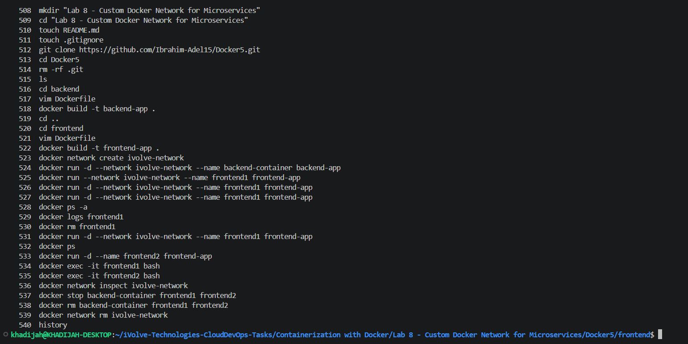

# Lab 8: Custom Docker Network for Microservices

## Overview

This lab demonstrates Docker networking by deploying a simple frontend and backend microservice architecture. A custom Docker bridge network was created to allow communication between containers. The lab verifies that containers connected to the same custom network can communicate using container names, while containers running on different networks cannot.

---

## Key Concepts

### Custom Docker Network

Docker allows creating isolated bridge networks to enable communication between related containers.

```bash
docker network create ivolve-network
```

Containers attached to the same custom network can communicate using container names as hostnames through Docker's internal DNS.

---

### Microservices Communication

The application consists of:

- Frontend Service
- Backend Service

Each service runs in its own container and communicates over the Docker network.

---

## Tools Used

- Docker
- Python
- Flask

---

## Project Structure

```text
Docker5/
├── frontend/
│   ├── app.py
│   ├── requirements.txt
│   └── Dockerfile
│
└── backend/
    ├── app.py
    └── Dockerfile
```

---

## Backend Dockerfile

```dockerfile
FROM python:3.11

WORKDIR /app

COPY . .

RUN pip install flask

EXPOSE 5000

CMD ["python", "app.py"]
```

---

## Frontend Dockerfile

```dockerfile
FROM python:3.11

WORKDIR /app

COPY . .

RUN pip install -r requirements.txt

EXPOSE 5000

CMD ["python", "app.py"]
```

---

## Build Docker Images

### Backend

```bash
cd backend

docker build -t backend-app .
```

### Frontend

```bash
cd ../frontend

docker build -t frontend-app .
```

---

## Create Custom Network

```bash
docker network create ivolve-network
```

Verify network creation:

```bash
docker network ls
```

---

## Run Containers

### Backend Container

```bash
docker run -d \
--name backend \
--network ivolve-network \
backend-image
```

### Frontend1 Container (Custom Network)

```bash
docker run -d \
--name frontend1 \
--network ivolve-network \
frontend-image
```

### Frontend2 Container (Default Network)

```bash
docker run -d \
--name frontend2 \
frontend-image
```

---

## Verify Network Configuration

Inspect the custom network:

```bash
docker network inspect ivolve-network
```

Expected result:

- backend is connected to ivolve-network
- frontend1 is connected to ivolve-network
- frontend2 is not connected to ivolve-network

---

## Verify Communication

### Frontend1 → Backend (Success)

Enter frontend1:

```bash
docker exec -it frontend1 bash
```

Run:

```bash
curl http://backend:5000
```

Expected output:

```text
Hello from Backend!
```

This confirms that frontend1 can resolve and communicate with backend through Docker DNS because both containers are attached to the same network.

---

### Frontend2 → Backend (Failure)

Enter frontend2:

```bash
docker exec -it frontend2 bash
```

Run:

```bash
curl http://backend:5000
```

Expected output:

```text
curl: (6) Could not resolve host: backend
```

This confirms that frontend2 cannot communicate with backend because it is running on the default bridge network instead of ivolve-network.

---

## Screenshots

### Commands Used



---


### Frontend1 Communication Success


---

### Frontend2 Communication Failure


---

## Outcome

A custom Docker network named `ivolve-network` was successfully created and used to connect frontend1 and backend containers.

Communication between frontend1 and backend was successful because both containers were attached to the same custom network. Docker's internal DNS resolved the backend container name correctly.

A second frontend container was launched using the default bridge network. Communication between frontend2 and backend failed because they were not connected to the same Docker network.

This lab demonstrated how Docker networking enables service discovery and communication between microservices while maintaining network isolation between unrelated containers.

---

## Cleanup

Stop and remove containers:

```bash
docker stop backend frontend1 frontend2

docker rm backend frontend1 frontend2
```

Delete the custom network:

```bash
docker network rm ivolve-network
```