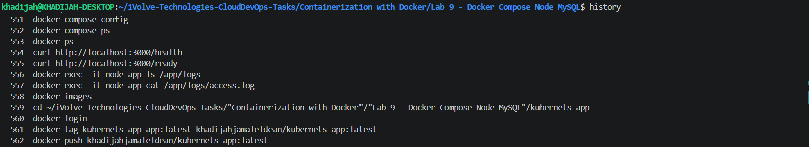
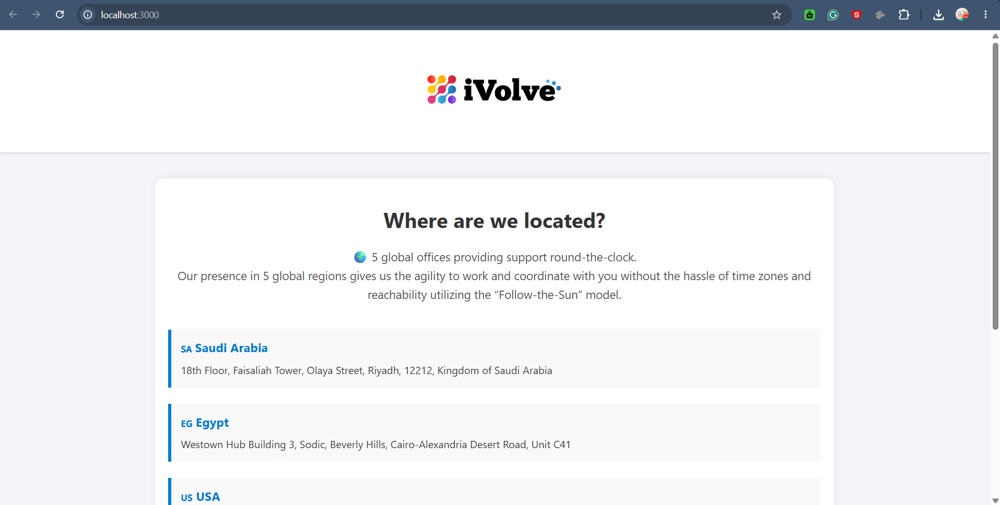
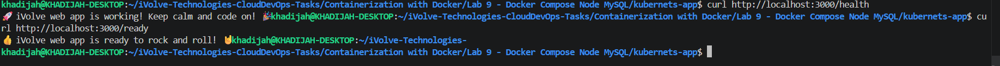
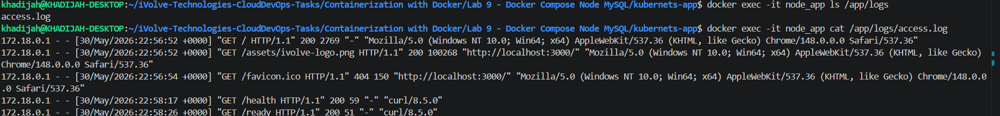

# Lab 9: Containerized Node.js and MySQL Stack Using Docker Compose

## Overview

This lab demonstrates how to deploy a multi-container application using Docker Compose. The application consists of a Node.js web application and a MySQL database running in separate containers. Docker Compose is used to define, build, and manage both services through a single configuration file.

---

## Key Concepts

### Docker Compose

Docker Compose allows multiple containers to be defined and managed as a single application using a `docker-compose.yml` file.

Using a single command:

```bash
docker-compose up -d
```

all required services are created, connected, and started automatically.

---

### Multi-Container Architecture

The application consists of:

- Node.js Application Container
- MySQL Database Container

Both containers communicate through the default Docker Compose network.

---

### Persistent Storage

A named volume was created to persist MySQL data:

```text
db_data
```

The volume is mounted to:

```text
/var/lib/mysql
```

ensuring database data remains available even if the database container is recreated.

---

## Tools Used

- Docker
- Docker Compose
- Node.js
- MySQL

---

## Project Structure

```text
kubernets-app/
├── Dockerfile
├── server.js
├── db.js
├── package.json
├── frontend/
└── docker-compose.yml
```

---

## Docker Compose Configuration

```yaml
version: '3.8'

services:
  app:
    build: .
    container_name: node_app
    ports:
      - "3000:3000"
    environment:
      DB_HOST: db
      DB_USER: root
      DB_PASSWORD: root
      DB_NAME: ivolve
    depends_on:
      - db

  db:
    image: mysql:8
    container_name: mysql_db
    restart: always
    environment:
      MYSQL_ROOT_PASSWORD: root
      MYSQL_DATABASE: ivolve
    volumes:
      - db_data:/var/lib/mysql

volumes:
  db_data:
```

---

## Build and Run the Application

Build and start all services:

```bash
docker-compose up -d --build
```

Verify running containers:

```bash
docker ps
```

Expected containers:

```text
node_app
mysql_db
```

---

## Verify Application

Open:

```text
http://localhost:3000
```

The application should load successfully and display the product catalog.

---

## Verify Health Endpoint

```bash
curl http://localhost:3000/health
```

Expected output:

```text
iVolve web app is working!
```

---

## Verify Readiness Endpoint

```bash
curl http://localhost:3000/ready
```

Expected output:

```text
iVolve web app is ready
```

---

## Verify Access Logs

List log files:

```bash
docker exec -it node_app ls /app/logs
```

View access log:

```bash
docker exec -it node_app cat /app/logs/access.log
```

This confirms that application requests are being logged successfully.

---

## Verify Docker Images

```bash
docker images
```

The application image was built successfully:

```text
kubernets-app_app:latest
```

---

## Push Image to Docker Hub

Login to Docker Hub:

```bash
docker login
```

Tag the image:

```bash
docker tag kubernets-app_app:latest <dockerhub-username>/kubernets-app:latest
```

Push the image:

```bash
docker push <dockerhub-username>/kubernets-app:latest
```

Verify the image is available in your Docker Hub repository.

---

## Screenshots

### Docker Compose Build and Deployment



---

### Application Running



---

### Health&Ready Endpoint



---


### Access Logs



---

### Docker Hub Repository


---

## Outcome

A multi-container application was successfully deployed using Docker Compose. The Node.js application and MySQL database were connected through a Docker network and managed as a single stack.

The application successfully connected to the database, created the required `ivolve` database, served web content on port 3000, exposed health and readiness endpoints, generated access logs, and was packaged into a Docker image that was successfully pushed to Docker Hub.

This lab demonstrated how Docker Compose simplifies container orchestration, networking, environment variable management, persistent storage, and application deployment.