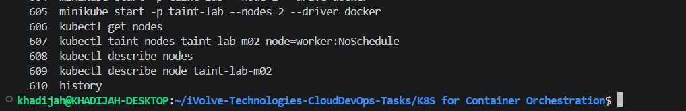
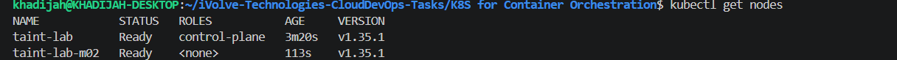
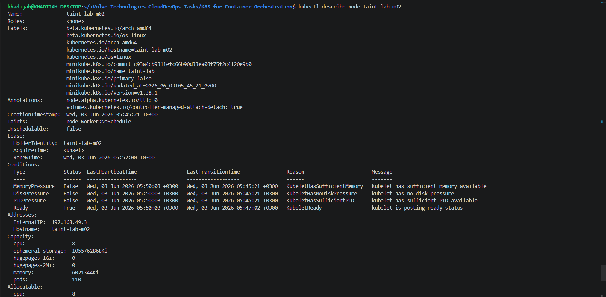

# Lab 10: Node Isolation Using Taints in Kubernetes

## Objective

The objective of this lab is to demonstrate node isolation in Kubernetes using taints. A taint is applied to a node to prevent pods from being scheduled on it unless they have a matching toleration.

---

## Prerequisites

Before starting this lab, ensure that the following requirements are met:

- Ubuntu/Linux environment
- Minikube installed
- kubectl installed and configured
- Docker installed and running
- Internet connection

---

## Steps

### 1. Create a Kubernetes Cluster with 2 Nodes

Start a Minikube cluster with two nodes:

```bash
minikube start -p taint-lab --nodes=2 --driver=docker
```

Verify that both nodes are running:

```bash
kubectl get nodes
```

Expected output:

```text
NAME          STATUS   ROLES           AGE
taint-lab     Ready    control-plane   xx
taint-lab-m02 Ready    <none>          xx
```

---

### 2. Apply a Taint to the Worker Node

Apply a taint to the second node:

```bash
kubectl taint nodes taint-lab-m02 node=worker:NoSchedule
```

Expected output:

```text
node/taint-lab-m02 tainted
```

This taint prevents pods from being scheduled on the node unless they have a matching toleration.

---

### 3. Verify the Taint Configuration

Describe the worker node:

```bash
kubectl describe node taint-lab-m02
```

Verify that the following taint appears:

```text
Taints:
 node=worker:NoSchedule
```

---

### 4. Describe All Nodes

Display detailed information about all nodes:

```bash
kubectl describe nodes
```

This confirms that the taint has been successfully applied to the target node.

---

## Screenshots

### Commands Used



---

### Node List



---

### Node Description (Taint Verification)



---

## Summary

In this lab:

- A Kubernetes cluster with two nodes was created using Minikube.
- A taint (`node=worker:NoSchedule`) was applied to the worker node.
- Node descriptions were inspected to verify the taint configuration.
- Kubernetes scheduling restrictions using taints were successfully demonstrated.

---

## Notes

- **Taints** are used to repel pods from specific nodes.
- The **NoSchedule** effect prevents new pods from being scheduled on the tainted node.
- Pods can only run on a tainted node if they have a matching **Toleration**.
- Taints are commonly used to dedicate nodes for specific workloads or isolate critical resources.

--- 