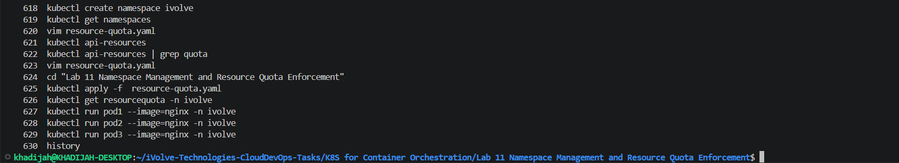
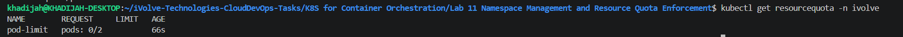
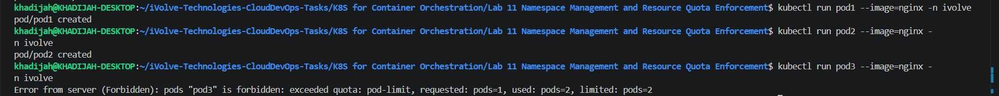

# Lab 11: Namespace Management and Resource Quota Enforcement

## Objective

The objective of this lab is to demonstrate namespace management and resource quota enforcement in Kubernetes by creating a dedicated namespace and limiting the maximum number of pods that can run within it.

---

## Prerequisites

Before starting this lab, ensure the following requirements are met:

- Ubuntu/Linux environment
- Kubernetes cluster running (Minikube)
- kubectl installed and configured
- Docker installed and running
- Basic understanding of Kubernetes namespaces and resource quotas

---

## Steps

### 1. Create a Namespace

Create a namespace named `ivolve`:

```bash
kubectl create namespace ivolve
```

Verify the namespace creation:

```bash
kubectl get namespaces
```

---

### 2. Create a Resource Quota Definition

Create a file named `resource-quota.yaml`:

```yaml
apiVersion: v1
kind: ResourceQuota

metadata:
  name: pod-limit
  namespace: ivolve

spec:
  hard:
    pods: "2"
```

This resource quota limits the namespace to a maximum of **2 pods**.

---

### 3. Apply the Resource Quota

Apply the configuration:

```bash
kubectl apply -f resource-quota.yaml
```

Expected output:

```text
resourcequota/pod-limit created
```

---

### 4. Verify the Resource Quota

Check the quota details:

```bash
kubectl get resourcequota -n ivolve
```

Example output:

```text
NAME        REQUEST   LIMIT   AGE
pod-limit   pods: 0/2         66s
```

---

### 5. Test the Quota Enforcement

Create the first pod:

```bash
kubectl run pod1 --image=nginx -n ivolve
```

Create the second pod:

```bash
kubectl run pod2 --image=nginx -n ivolve
```

Attempt to create a third pod:

```bash
kubectl run pod3 --image=nginx -n ivolve
```

Expected result:

```text
Error from server (Forbidden): pods "pod3" is forbidden:
exceeded quota: pod-limit, requested: pods=1,
used: pods=2, limited: pods=2
```

This confirms that the resource quota is being enforced successfully.

---

## Screenshots

### Commands History



---

### Resource Quota Verification



---

### Quota Enforcement Test



---

## Summary

In this lab:

- A namespace named `ivolve` was created.
- A `ResourceQuota` object was configured and applied.
- The namespace was limited to a maximum of two pods.
- Resource quota enforcement was validated by attempting to create a third pod.
- Kubernetes successfully blocked the creation of additional pods beyond the configured limit.

---

