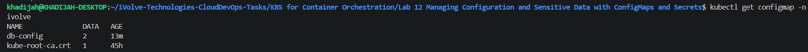
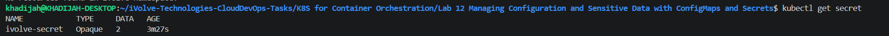
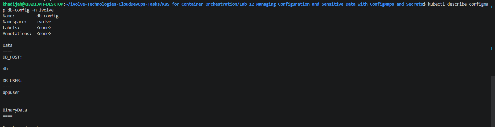
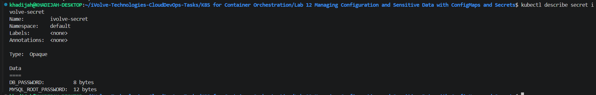
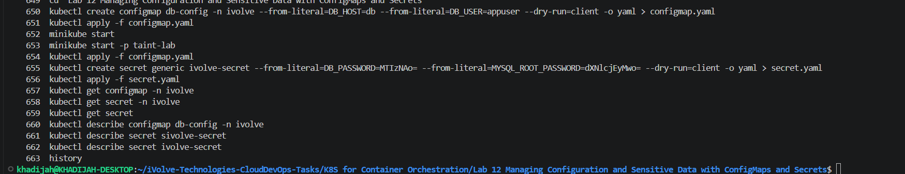

# Lab 12: Managing Configuration and Sensitive Data with ConfigMaps and Secrets

## Objective

Create and manage Kubernetes ConfigMaps and Secrets to store non-sensitive and sensitive application configuration data separately and securely.

---

## Prerequisites

- Ubuntu / Debian-based Linux system
- Kubernetes cluster (Minikube)
- kubectl installed and configured
- Existing namespace `ivolve`
- Internet connection

---

## Steps

### 1. Create ConfigMap

Generate a ConfigMap YAML file:

```bash
kubectl create configmap db-config -n ivolve \
--from-literal=DB_HOST=db \
--from-literal=DB_USER=appuser \
--dry-run=client -o yaml > configmap.yaml
```

Generated YAML:

```yaml
apiVersion: v1
data:
  DB_HOST: db
  DB_USER: appuser
kind: ConfigMap
metadata:
  name: db-config
  namespace: ivolve
```

Apply ConfigMap:

```bash
kubectl apply -f configmap.yaml
```

---

### 2. Create Secret

Generate a Secret YAML file:

```bash
kubectl create secret generic ivolve-secret \
--from-literal=DB_PASSWORD=MTIzNAo= \
--from-literal=MYSQL_ROOT_PASSWORD=dXNlcjEyMwo= \
--dry-run=client -o yaml > secret.yaml
```

Generated YAML:

```yaml
apiVersion: v1
data:
  DB_PASSWORD: TVRJek5Bbz0=
  MYSQL_ROOT_PASSWORD: ZFhObGNqRXlNd289
kind: Secret
metadata:
  name: ivolve-secret

```

Apply Secret:

```bash
kubectl apply -f secret.yaml
```

---

### 3. Verify Resources

Verify that the ConfigMap and Secret were created successfully:

```bash
kubectl get configmap -n ivolve
```

```bash
kubectl get secret
```

---

### 4. Describe ConfigMap

Display detailed information about the ConfigMap:

```bash
kubectl describe configmap db-config -n ivolve
```

---

### 5. Describe Secret

Display detailed information about the Secret:

```bash
kubectl describe secret ivolve-secret
```

---

## Screenshots

### ConfigMap Listed



---

### Secret Listed



---

### Describe ConfigMap



---

### Describe Secret



---

### Commands History



---

## Summary

| Step | Command / Action | Result |
|--------|--------|--------|
| Create ConfigMap | YAML + kubectl apply | Non-sensitive configuration stored |
| Create Secret | YAML + kubectl apply | Sensitive credentials stored |
| Verify Resources | kubectl get | Resources listed successfully |
| Describe ConfigMap | kubectl describe configmap | Configuration values displayed |
| Describe Secret | kubectl describe secret | Secret details displayed |

---

## Notes

- ConfigMaps are used to store non-sensitive configuration data.
- Secrets are used to store sensitive information such as passwords and credentials.
- Secret values are stored in Base64 format.
- Base64 encoding is not encryption and should not be considered a security mechanism by itself.
- ConfigMaps and Secrets can be consumed by Pods as environment variables or mounted files.
- The `kubectl describe` command provides detailed information about Kubernetes resources.
- The ConfigMap was created in the `ivolve` namespace.
- The Secret was generated using Base64-encoded values.

---